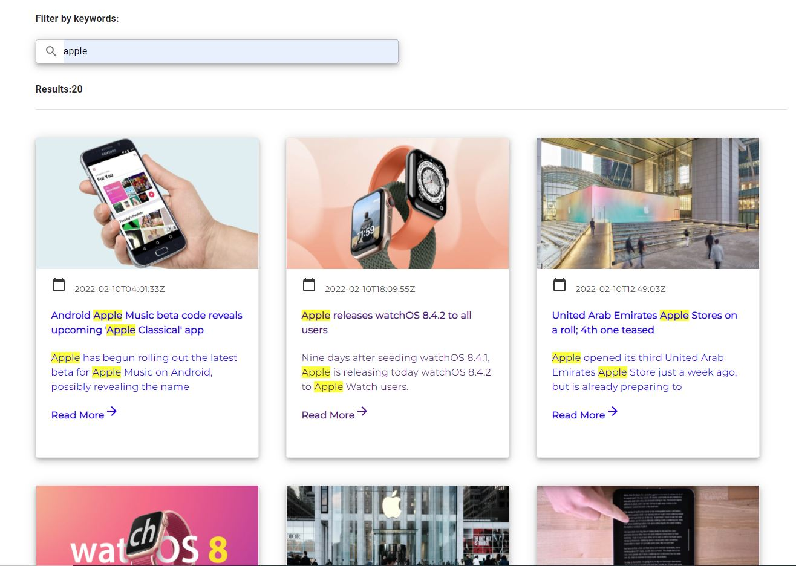

# Single Page Application for articles management on ReactJS.

## Project features

- Cards with article titles and descriptions for 100 characters. The user can click on the card and should go to a page with the title and full description of the selected article (the content truncated to 200 chars by News API).
- The user enters keywords into the field and the system displays all articles containing at least one of the keywords in the name or/and description.
- The priority of fields is name->description. The article with 1 match in the name is higher than the article with 1 match in the description.
- The matched keywords are highlighted with yellow color.
- TypeScript used as the main language for the test project.
- Material UI need to be used.
- https://newsapi.org/ used to get article names and descriptions.
